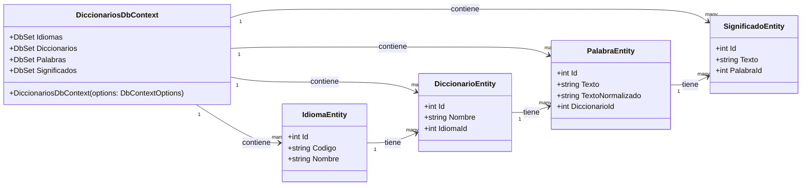
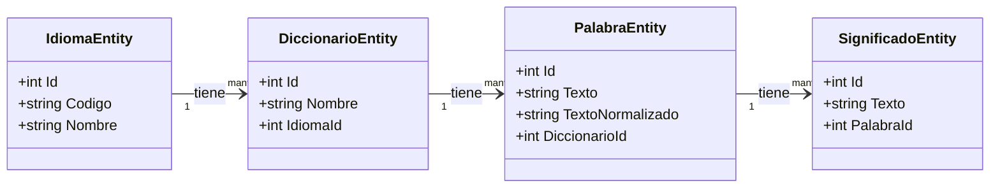
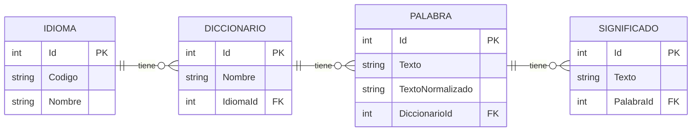

# Pasos para crear la app:

1. Crear una solucion con dotnet

2. Crear el proyecto (librería) del API de diccionarios             CLASSLIB (librería)
   Añadir ese proyecto a la solución

3. Crear el proyecto implementación a ficheros del api              CLASSLIB (librería)
   Añadir ese proyecto a la solución

4. Crear un proyecto de pruebas para el proyecto de implementación  XUNIT(librería pero de pruebas)
   Añadir ese proyecto a la solución


Lo siguiente es establecer las DEPENDENCIAS ENTRE PROYECTOS
 (esto lo ejecutamos dentro de la carpeta del proyecto donde queremos meter la dependencia) 
 dotnet add reference <ruta del proyecto dependencia> 
    Ficheros -> API
    Ficheros.Test -> Ficheros, API


Tenemos que montar ahora una app de consola que trabaje con esta librería de diccionarios.

La vamos a montar poco a poco:
1. Código hardocodeado = SENCILLO => Inmantenible a largo plazo
^^^
50 líneas de código

2. Código con inyección de dependencias manual = MAS CURRO HOY Y algo más mantenible a largo plazo
3. Código con inyección de dependencias automática = MAS CURRO HOY Y MÁS MANTENIBLE A LARGO PLAZO
4. Con inversión de control (HOST) y la inyección de dependencias automática = MUCHISISMO MÁS CURRO HOY Y MUCHISIMO MAS MANTENIBLE A LARGO PLAZO
^^^
300 líneas de código

Estamos con una app de consola... y nos podemos permitir el lujo de comenzar con un código hardcodeado y sin usar Inversión de Control (HOST).

Pero.. en una app web no nos lo podemos permitir. Tenemos que comenzar con Inversión de Control (HOST) y la inyección de dependencias automática.
---

Por ahora, el objetivo es montar un proyecto nuevo, DiccionariosAppConsola, que use la librería DiccionariosFicheros y que haga lo siguiente:
- Mostrar un mensaje de bienvenida (Con iconos chulos)
- Recibe como argumentos el idioma y la palabra a buscar
- - Mira a ver si hay un diccionario para ese idioma
- - Si no lo hay, avisa al usuario y termina (Con iconos chulos)
- - Si lo hay, mira a ver si la palabra existe en el diccionario
- - - Si no existe, avisa al usuario y termina (Con iconos chulos)
- - - Si existe, muestra los significados (Con iconos chulos)
- - Termina
- Mostrar un mensaje de despedida y agradecimiento (Con iconos chulos)

Por ahora, nada de nada de inyección de dependencias ni inversión de control.


----

# Segunda variante del proyecto de AppConsola:

En este caso vamos a comenzar con la inyección de dependencias manual. Y no vamos a usar todavía inversión de control (HOST).
Esto ya me revuelve algunos problemas de mnto. 
Voy a seguir yo creando las instancias de las clases, pero solamente tendré una función en todo el proyecto que se encargue de crear las instancias. Si algun día hay que cambiar una implementación por otra, solamente habrá que cambiar esa función.
Pasra esto vamos a usar una clase que nos ofrece .net llamada ServiceCollection:
- Nos creamos un serviceCollection
- Registramos en el serviceCollection las implementaciones de las interfaces que vamos a usar
- Creamos un serviceProvider a partir del serviceCollection
- La misión del ServiceCollection es registrar las implementaciones de las interfaces que le pidamos.
    - A tal Interfaz , usas tal Implementación
- La misión del ServiceProvider es darnos instancias de las clases que le pidamos, y resolver las dependencias que tengan esas clases.
    - Dame una instancia de tal Interfaz, y resuelve las dependencias que tenga esa implementación.

Dejaremos una función aparte en el código (incluso en su propio fichero) que se encargue de la gestión de dependencias, del trabajo con el ServiceCollection y el ServiceProvider.

PERO! OJO! Todo esto lo montaremos en un nuevo proyecto, para no liarla con el proyecto anterior.
El que tenemos ahora es el DiccionariosAppConsola.
El nuevo que vamos a montar es DiccionariosAppConsolaConDI (DI = Dependency Injection = Inyección de Dependencias)


```csharp
   var collection = new ServiceCollection();
   //collection.AddSingleton<IInterfaz, Implementacion>();
   collection.AddTransient<ISuministradorDeDiccionarios, SuministradorDeDiccionariosDesdeFicheros>();


   var provider = collection.BuildServiceProvider();
   var suministrador = provider.GetService<ISuministradorDeDiccionarios>();
   // Podría incluso haber muchas implementaciones de IDiccionario, en ese caso, obtendría todas ellas y elegiría la que me interesara.. o si incluso quiero trabajar con todas ellas.
   var suministradores = provider.GetServices<ISuministradorDeDiccionarios>();
   // Para cada suministrador podríamos preguntar si tiene el diccionario que queremos, y si lo tiene, usarlo.

   foreach (var suministrador in suministradores)
   {
       if (suministrador.TieneDiccionario(idioma))
       {
           var diccionario = suministrador.ObtenerDiccionario(idioma);
           // Usar el diccionario
           break;
       }
   }
```
---

Queremos el siguiente paso ahora... Será un tercer proyecto de app de consola, que usará inyección de dependencias manual (Suministrando nosotros la instancia que debe entregarse al solicitar una interfaz) y además usará inversión de control (HOST) para gestionar el ciclo de vida de la aplicación y la inyección de dependencias automática (El HOST se encargará de crear las instancias y resolver las dependencias).
Aquí trabajamos con otros concepto:
- Host: Es el contenedor que gestiona el ciclo de vida de la aplicación y la inyección de dependencias automática. Es el que ofrece la Inversión de Control.
- Configuración del Host: Es el proceso de configurar el Host:
  - Registro de los servicios y las implementaciones de las interfaces que vamos a usar.
  - Configuración del logging
  - Lectura de parametros de configuración (appsettings.json, variables de entorno, argumentos de línea de comandos, etc.)
  - Lectura de variables de entorno para aplciar configuraciones específicas para cada entorno (desarrollo, producción, etc.)

El host ya lleva su propio flujo.
Lo que hará será:
- Crear el host
- Configurar el host
- Configurar los servicios (Inyección de dependencias)
- Leer los parámetros de configuración
- Leer las variables de entorno
- Construir el host
- Iniciar el host
- Ejecutar la aplicación

Aqui va a haber un cambio grande de enfoque...
La propia aplicacionDeConsola, la vamos a convertir en un servicio más del host.

# Lo que hay:
      MAIN (arranque)
        v
    AppConsola ---> DiccionariosAPI
    
    De donde saca la AppDeConsola la instancia de DiccionariosAPI?
    Del ServicePrivider... La coge ella (esa clase). Esa clase(AppConsola)solicita explicitamente la instancia que necesita al ServiceProvider.

# Lo nuevo

    MAIN > HOST > Servicios: - DiccionariosAPI                < DiccionariosFicheros
             |               - UIAplicacionDeDiccionariosAPI  < UIAplicacionDeDiccionariosConsola
             +-> Coge la AplicacionDeDiccionariosAPI que se ha registrado como servicio


                  y la ejecuta. Nuestro AplicacionDeDiccionariosConsola solicitaré en su constructor
                    la instancia de DiccionariosAPI que necesita, y el HOST se la suministrará

                    La responsabilidad de obtener un suministradorDeDiccionarios ya no la tendrá nuestra app, la tendrá el HOST.

                    Esto me permitirá el día de mañana tener varias implementaciones de la App:
                    - Consola
                    - Escritorio
                    - Web
                 Y el código no cambiará nada. Solamente cambiará el registro del servicio en el HOST.

Esa UIAplicacionDeDiccionariosAPI
tendrá sus nuevos métodos:
- MostrarMensajeBienvenida()
- MostrarMensajeDespedida()
- MostrarSignificadosDePalabra()
- MostrarErrorNoHayDiccionario()
- MostrarErrorNoHayPalabra()

Nuestra implementación actual de DiccionarioFicheros, necesita una ruta de ficheros para funcionar.
Vamos a meter esa ruta en un fichero de configuración appsettings.json
Y vamos a configurar el HOST para que lea ese fichero de configuración se encargue de pasarle esa ruta a la implementación de DiccionarioFicheros. SuministradorDeDiccionariosDesdeFicheros pedirá esa ruta en su constructor, y el HOST se la suministrará.


---

Si somos Decatlon,creando bicletas, lo que harías es trabajar con ESPECIFICACIONES = APIs
 - DiccionariosAPI (Interfaz)
 - UIAplicacionDeDiccionariosAPI (Interfaz)

Ahora, cuando monte una bici, ya no trabajo con especificaciones, trabajo con COMPONENTES concretas.

Nuestra bici es el HOST (la aplicación), que trabajará con componentes concretos:

 - DiccionariosFicheros (Implementación de DiccionariosAPI)
 - UIAplicacionDeDiccionariosConsola (Implementación de UIAplicacionDeDiccionariosAPI)


---

# UML? 

Estándar (ISO) para definir GRAFICOS/DIAGRAMAS
Nos ofrece un lenguaje para crear DIAGRAMAS.

La idea es estandarizar los diagramas para que todo el mundo los entienda.
Esto tiene más años que maricataña... Y CAYO TOTALMENTE EN DESUSO.
Por qué? La idea era buena.. muy buena...
Pero los programas que había para pintar esos diagramas eran un tostón. Te pasabas horas! Eran tipo PowerPoint.. con cajitas.. flechitas..
Y encima hay que mantenerlo!

Hoy en día estamos empezando de nuevo a usarlos muchísimo, porque la idea es buena, y ahora tenemos herramientas que nos permiten generarlos automáticamente.

Lo que tenemos hoy en día son LENGUAJES para escribir diagramas de UML
Ya no los pintamos... los escribimos en un lenguaje de texto, y luego una herramienta los pinta por nosotros:
- PlantUML                      Soporta el estandar completo de UML. Es un lenguaje ASPERO! Y Además los graficos son feos.
- Mermaid (El que usa GitHub)  No soporta el estandar completo de UML. Es un lenguaje MUY SUAVE! Y los graficos son bonitos.

Y la gracia es que con ellos, los diagramas no los pintamos, los escribimos. Y de hecho, ni los escribimos. Hay gente hoy en día que son mucho mejores que nosotros escribiendo textos: Las IAs
Y les vamos a pedir que nos ayuden con los diagramas.


```csharp
public class HolaMundo
{
    public static void Main()
    {
        Console.WriteLine("Hola Mundo");
    }
}
```

Estos programas suelen admitir Mermaid sin problema como código


Yo ahora quiero generar dentro de este archivo (MARKDOWN) un diagrama de componentes que represente la arquitectura de la aplicación que hemos montado. En Markdown podemos usar código
Que básicamente son:

    MAIN > HOST > Servicios: - DiccionariosAPI                < DiccionariosFicheros
             |               - UIAplicacionDeDiccionariosAPI  < UIAplicacionDeDiccionariosConsola
             +-> Coge la AplicacionDeDiccionariosAPI que se ha registrado como servicio
Orientacion girada Derecha-Izquierda


---

Siguiente objetivo:

Cambiar la implementación de SuministradorDeDiccionariosDesdeFicheros por una que trabaje con BBDD SQL.
Para hacer ese trabajo vamos a tirar el Entity Framework Core (Esto es parte clave de .net Core).
Esa librería me permite:
- Mapear clases a tablas de BBDD... sin tener que escribir SQL
- Para consultas muy específicas, puedo usar LINQ (Language Integrated Query) que es un lenguaje de consultas integrado en C#.
- Para consultas muy específicas que no pueda hacer con LINQ, puedo escribir SQL directamente.
- Me va a generar en automático el esquema de la BBDD a partir de las clases que yo le diga.
- Y aplicará ese esquema a la BBDD que yo le diga (SQL Server, SQLite, MySQL, PostgreSQL, etc.)
- Es más, si el día de mañana hay algun cambio en mis Entidades que voy a persistir, me genera las migraciones que necesito para actualizar el esquema de la BBDD sin perder los datos que ya tengo.... y los aplica a la BBDD que yo le diga.
- LA UNICA FUENTE DE VERDAD será nuestro código C#. <<<<<<<< Y ESTO ES FLIPANTE!


Antiguamente, nosotros teníamos que crear la BBDD, con sus tablas, sus relaciones, sus índices, etc.... en un script SQL.
Y luego definíamos las clases C# que representaban los datos que teníamos en la BBDD.
Y nos comíamos la escritura de queries para sacar los datos que necesitábamos y convertirlos en objetos C#.

TODO ESO ES GRATIS con Entity Framework Core... Pero.. Esta librería no es nada especial. Ese concepto le tengo en todo lenguaje de programación moderno.
- JAVA: JPA (Java Persistence API) con Hibernate
- Python: SQLAlchemy
...

Este tipo de librerías, como Hibernate, SQLAlchemy o Entity Framework Core, se llaman ORM (Object-Relational Mapping) o Mapeo Objeto-Relacional. 
No es sólo que me ahorren mucho trabajo, que lo hacen. 
La gracia grande es otra, mucho más que las 500 horas que me voy a ahorrar escribirnedo queries.. transformando datos, etc.
La gracia grande es que tengo una única fuente de verdad: Mi código C#.
En ese fichero, declaro la estructura de mis datos en C# y la de la BBDD.
No hay posibilidad de error o desincronización. PORQUE SOLO HAY UNA UNICA FUENTE DE VERDAD: MI CÓDIGO C#.
Y la estructura de la BBDD queda atada (y sincronizada) a la estructura de mis clases C#.
Y ESTO ES FLIPANTE! Y me evita una cantidad de problemas y errores brutales.

Y por eso hoy en día es impensable trabajar sin un ORM en cualquier lenguaje de programación moderno.

De alguna forma, lo que estamos es versionando en automático la estructura de la BBDD, junto con el código C#.

---
Proceso de trabajo (lo que vamos a hacer):
1. Crear un proyecto nuevo de librería de clases, DiccionariosBBDD
2. Añadir ese proyecto a la solución
3. Añadir la referencia al proyecto DiccionariosAPI (porque esa librería va a implementar esa API)
4. Añadir el paquete NuGet de Entity Framework Core (Microsoft.EntityFrameworkCore)
5. Añadir el paquete NuGet del proveedor de BBDD que vayamos a usar (MariaDB, Postgres..). NI DE COÑA  quiero eso aquí.
   Donde quiero esa configuración? A nivel del proyecto de la app host... la que INTEGRA COMPONENTES. SOLUCION FINAL!
6. Crear las entidades que voy a persistir en la BBDD. Una entidad es una clase C# que representa objetos que quiero persistir en la BBDD.
   En nuestro caso, las entidades son:
   - Idioma
   - Diccionarios
   - Palabra
   - Significado
7. Crear el DbContext. El DbContext es la clase que representa la BBDD y me permite interactuar con ella.
   // Cuando quiera guardar un diccionario, una palabra o un significado, lo haré a través del DbContext.
   Cuando quiera obtener un diccionario, una palabra o un significado, lo haré a través del DbContext.
8. Crear la implementación de ISuministradorDeDiccionarios, SuministradorDeDiccionariosDesdeBBDD
   Esa clase usará el DbContext para obtener los datos que necesite... cómo se lo pasaremos?  Por inyección de dependencias.
9. Crear un proyecto de pruebas para el proyecto DiccionariosBBDD.. que trabaje con una BBDD en memoria (SQLite en memoria)


^^^^^^^ Es todo trabajo nuevo.

10. Por último, cambiaremos en el proyecto host 2 cositas:
   - Añadir las dependencias del nuevo proveedor de BBDD y del driver concreto (MariaDB, Postgres..)
   - Modificar las propiedades de configuración para añadir la cadena de conexión a la BBDD... quitando el rollito de las carpetas.


---


```csharp

public class DiccionariosDbContext : DbContext
{
    public DbSet<IdiomaEntity> Idiomas { get; set; }
    public DbSet<DiccionarioEntity> Diccionarios { get; set; }
    public DbSet<PalabraEntity> Palabras { get; set; }
    public DbSet<SignificadoEntity> Significados { get; set; }

    public DiccionariosDbContext(DbContextOptions<DiccionariosDbContext> options) : base(options) { }
}

public class IdiomaEntity
{
    public int Id { get; set; }
    public string Codigo { get; set; } = string.Empty;
    public string Nombre { get; set; } = string.Empty;
}

public class DiccionarioEntity
{
    public int Id { get; set; }
    public string Nombre { get; set; } = string.Empty;
    public int IdiomaId { get; set; }
}

public class PalabraEntity
{
    public int Id { get; set; }
    public string Texto { get; set; } = string.Empty;
    public string TextoNormalizado { get; set; } = string.Empty;
    public int DiccionarioId { get; set; }
}

public class SignificadoEntity
{
    public int Id { get; set; }
    public string Texto { get; set; } = string.Empty;
    public int PalabraId { get; set; }
}

```

# Quiero ahora un diagrama de clases en mermaid: Con layout horizontal




Las clases que creamos en cualquier lenguaje de programación son de tipos diferentes... y están muy estudiadas por las arquitecturas de software:
- Entidades: Representan objetos del mundo real que tienen identidad propia y ciclo de vida. Ejemplo: Usuario, Producto, Pedido.
- Repositorios: Encapsulan la lógica para acceder a los datos de las entidades. Ejemplo: UsuarioRepositorio, ProductoRepositorio.
- Servicios: Contienen la lógica de negocio que opera sobre las entidades. Ejemplo: UsuarioServicio, ProductoServicio.
- Controladores: Manejan las solicitudes entrantes y coordinan la interacción entre los servicios y las vistas. Ejemplo: UsuarioControlador, ProductoControlador.
- Vistas: Representan la interfaz de usuario y muestran los datos al usuario. Ejemplo: UsuarioVista, ProductoVista.
- DTOs (Data Transfer Objects): Son objetos simples que se utilizan para transfer
- Mappers: Son clases que se encargan de convertir entre diferentes tipos de objetos, como entre entidades y DTOs. Ejemplo: UsuarioMapper, ProductoMapper.

# Quiero ahora ese mismo diagrama de clases, solo con las entidades y sus. relaciones



Lo que hemos hecho es un diagrama ENTIDAD x RELACION, que es el que usamos habitualmente para diseñar BBDD relacionales.

Mermaid  ofrece una representación adicional, más particular para BBDD... en horizontal:




Por rendimiento, vamos a normalizar los códigos de Idiomas en  en mayúsculas... en BBDD ...

Tenemos un campo código en la tabla Idiomas, que es un VARCHAR(5).
Pero puedo yo asegurar que cualquiera (yo.. o no yo en el futuro) no vaya a meter un idioma en minúsculas?

Que lo mismo alguien que está cargando datos en chino, coge y mete el idioma "ch" en minúsculas?
Y mi programa deja de funcionar.

Que solución le damos?
Un INDICE en la BBDD.

Qué es un índice en una BBDD?

Es una copia ORDENADA de unos datos...
Para qué me sirve: Para poder aplicar a la hora de una búsqueda un algoritmo de búsqueda binaria.
Sin un índice, para hacer una búsqueda debo aplicar un FULL SCAN... es decir, en cristiano: Debo ir mirando todos y cada uno de los datos del conjunto de datos a ver si encajan con lo que busco.
Uno a uno. Si tengo 1M de dato, cuantas comparaciones debo hacer? 1M

20.000 -> 10.000 -> 5.000

1M de datos, con busqueda binaria, cuantas comparaciones debo hacer? log2(1.000.000) = 20 comparaciones.

Si vosotros tuvieseis que buscar zapatilla en un diccionario... abriríais el diccionario por la primera por la mitad? NO..,. por le final.. por qué? Porque sabéis como se distribuyen las palabras en el diccionario.... Y que la Z está al final... Pero sabéis más cosas.
Cuántas palabras hay de la A? Muchas... y de la Z? Pocas.
Si ya estoy en la Z... y me he pasao.. cuantas hojas atrás voy? Poquitas poquitas... 2, 3
En cambio si estoy en la Abalorio.. y necesito llegar a Azabache... cuántas hojas adelante voy? Muuchas mas de 2 o 3.. por que de la A hay muchas palabras, muchas más que de la Z.

Las BBDD no son gilipollas.. y hacen lo mismo.. Tienen un concepto que se llama ESTADISTICAS.

Si tengo una columna de tipo int -> 4 bytes
Si tengo 1M de datos -> 4MB
Si tengo un índice sobre esa columna -> 4MB + 4MB = 8MB
Pero la reladida es que el índice se crea con un coeficiente de llenado: El que quiera: 50%...
En ese caso, en el fichero del índice se generan por cada entrada un hueco... para dejar espacio para futuras entradas. Y el índice en lugar de ocupar 4MB, ocupará 8MB.
Y esa columna que ocupaba 4Mbs en la tabla, en la BBDD ahora ocupará 12MB.

Me serviría crear un índice en la columna código de la tabla Idiomas, para ayudarnos con esto? NO
Porque yo no uso el campo Codigo... uso UPPER(Codigo)...
Y puedo tener el dato codigo en la tabla... pero crear un índice sobre UPPER(Codigo)?