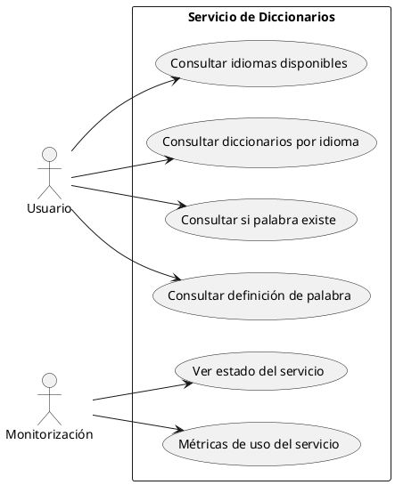

# Servicio REST para el acceso a estos diccionarios.

Hoy en día, esos monolitos se dividen en microservicios.

http://miempresa.com/api/v1/diccionarios
http://miempresa.com/api/v1/idiomas

# Protocolo HTTP

Es un protocolo de comunicación sobre TCP/IP para comunicaciones síncronas unidireccionales.
Si necesito otro tipo de comunicaciones (asincronas/bidxireccionales) no me sirve.
En el mundo web, por ejemplo, para comunicaciones bidireccionales asincronas, se usa WebSockets. ws://


    Cliente ---> http request ---> Servidor
            <--- http response --- 

    Servidor --------------------> Cliente
            (push asincrono)
            notificación

Tanto en request como en response, el mensaje tiene 2 partes en http: HEADERS + BODY (opcional)

Dentro de los headers que se mandan desde el cliente hay algunos notables:
- Authorization
- Content-Type
- Verb (Intención)
    GET -> Obtener recurso
    POST -> Crear recurso
    PUT -> Actualizar recurso
    DELETE -> Borrar recurso
    PATCH -> Actualizar parcialmente un recurso
    HEAD -> Obtener solo los headers de un recurso

Y dentro de los headers de vuelta hay uno especial:
- Response Code :
  - 2XX -> OK
  - 3XX -> Redirección
  - 4XX -> Error del cliente
  - 5XX -> Error del servidor

---

# Proyecto servicio web para acceso a todo este tinglao!

1. Casos de uso (Casos de uso y sus actores). Y de hecho en UML tenemos un diagrama de casos de uso.
   Mermaid no lo soporta. Si lo tiene plantUML.

Actor: 
    Usuario: Alguien que quiere consultar diccionarios... palabras...
    Monitorización: Alguien que quiere ver el estado del servicio web
Casos de uso:
    Usuario: 
        - Consultar los idiomas disponibles
        - Consultar los diccionarios disponibles para un idioma
        - Consultar si una palabra existe en un diccionario
        - Consultar la definición de una palabra en un diccionario
    Monitorización:
        - Ver estado del servicio 
        - Métricas de uso del servicio (Cuantas peticiones, tiempos, errores...)

Generamos ese diagrama en VERTICAL



2. Requisitos Funcionales (Solo CONSULTA - No CRUD)

 - **RF01**: El sistema debe permitir consultar los idiomas disponibles.
   ```
   GET /api/v1/idiomas
   ```
   Response Code: 200 OK
   ```json
   [
       { "codigo": "es", "nombre": "Español" },
       { "codigo": "en", "nombre": "English" },
       { "codigo": "fr", "nombre": "Français" }
   ]
   ```

 - **RF02**: El sistema debe permitir consultar los diccionarios disponibles para un idioma específico.
   ```
   GET /api/v1/idiomas/{codigo}/diccionarios
   ```
   Ejemplo: `GET /api/v1/idiomas/es/diccionarios`
   
   Response Code: 200 OK
   ```json
   [
       { "id": 1, "nombre": "Diccionario Español", "idioma": "es" }
   ]
   ```
   
   Response Code: 404 Not Found (si el idioma no existe)
   ```json
   { "error": "Idioma 'xx' no encontrado" }
   ```

 - **RF03**: El sistema debe permitir verificar si una palabra existe en un diccionario específico.
   ```
   GET /api/v1/idiomas/{codigo}/palabras/{palabra}/existe
   ```
   Ejemplo: `GET /api/v1/idiomas/es/palabras/casa/existe`
   
   Response Code: 200 OK
   ```json
   { "existe": true }
   ```
   
   Response Code: 200 OK (palabra no existe)
   ```json
   { "existe": false }
   ```

 - **RF04**: El sistema debe permitir consultar los significados de una palabra en un diccionario específico.
   ```
   GET /api/v1/idiomas/{codigo}/palabras/{palabra}/significados
   ```
   Ejemplo: `GET /api/v1/idiomas/es/palabras/casa/significados`
   
   Response Code: 200 OK
   ```json
   {
       "palabra": "casa",
       "idioma": "es",
       "significados": [
           "Edificio para habitar",
           "Familia o linaje"
       ]
   }
   ```
   
   Response Code: 404 Not Found (palabra no existe)
   ```json
   { "error": "Palabra 'xxx' no encontrada en el diccionario 'es'" }
   ```

 - **RF05**: El sistema debe permitir consultar todas las palabras disponibles en un diccionario (paginado).
   ```
   GET /api/v1/idiomas/{codigo}/palabras?page=1&size=50
   ```
   Ejemplo: `GET /api/v1/idiomas/es/palabras?page=1&size=10`
   
   Response Code: 200 OK
   ```json
   {
       "idioma": "es",
       "page": 1,
       "size": 10,
       "totalElements": 157,
       "totalPages": 16,
       "palabras": [
           "agua", "casa", "libro", "perro", ...
       ]
   }
   ```

 - **RF06**: El sistema debe proporcionar información de salud del servicio (health check).
   ```
   GET /api/v1/health
   ```
   Response Code: 200 OK
   ```json
   {
       "status": "UP",
       "timestamp": "2025-10-16T12:00:00Z",
       "checks": {
           "database": "UP",
           "diccionarios": "UP"
       }
   }
   ```

 - **RF07**: El sistema debe proporcionar métricas básicas de uso.
   ```
   GET /api/v1/metrics
   ```
   Response Code: 200 OK
   ```json
   {
       "totalConsultas": 1247,
       "consultasPorIdioma": {
           "es": 856,
           "en": 325,
           "fr": 66
       },
       "uptime": "5d 14h 32m"
   }
   ```

### Versionado de API

Qué significa ese **v1**? El MAJOR del servicio.

- Si tengo un servicio versión **1.1.0** y añado una funcionalidad nueva compatible, entonces la nueva versión será **1.2.0**
- ¿A alguien que estuviera usando la 1.1.0 le haría falta cambiar algo? **NO**

- En cambio, si hago un cambio que **rompe la compatibilidad**, la nueva versión será **2.0.0**
- Y tendré que dar una ruta HTTP nueva: `/api/v2/idiomas`

### Códigos de Respuesta HTTP

- **200 OK**: Consulta exitosa, datos devueltos
- **404 Not Found**: Recurso no encontrado (idioma, palabra, etc.)
- **400 Bad Request**: Parámetros inválidos 
- **500 Internal Server Error**: Error interno del servidor

                                                                                                                                        IDiccionario
            Controlador HTT REST V1                      >           Servicio                                               >    Repositorio (DBContext)
            GET /api/v1/idiomas                          >           - GetIdiomas() : IList<Idioma> throws BBDDNoDisponible
                IList<Idioma> -> JSON                                    Usará el DBContext para obtener Idiomas                 Consultar el BBDD y devolver.
                BBDDNoDisponible -> HTTP Status 500                      solicitar Incremento las estadísticas del sistema de monitorización ElasticSearch                                            Ese trabajo lo hace otro servicio.   > MongoDB/InfluxDB/Prometheus
 
            GET /api/v1/idiomas/{id}/diccionarios    >               - GetDiccionariosPorIdioma(codigo) : IList<Diccionario> throws IdiomaNoEncontrado, BBDDNoDisponible
                Qué datos devuelvo de un diccionario?
                   [
                    { "id": "KDASLKJASD-ASDKJASDIOAS-ADKLASDKJHJADS", "nombre": "Diccionario Español", "idioma": "es" }                 id, nombre, idioma, idPublico
                   ]

                    Una cosa son los datos que tengo en BBDD y otra cosa los datos que devuelvo en la API.
                    Quizás en BBDD tengo una tabla Diccionarios con 4 columnas llamadas: Id, Nombre, Idioma, IdPublico
                    Pero en mi json quiero 3 campos llamados: id, name, languageCode
                        
                         id = PublicoId
                         name = Nombre
                         languageCode = Idioma

                         El dato en BBDD Lo estoy representado en código mediante una Entidad: DiccionarioEntity
                         Necesito una estructura de datos (Clases) que representen los datos que devuelvo en el controlador HTTP.
                         Esas clases se llaman DTO (Data Transfer Object)
                         ```csharp
                         public class DiccionarioDtoV2
                         {
                            public string Id { get; set; }  // IdPublico en BBDD
                            public string Name { get; set; } // Nombre en BBDD
                            public string LanguageCode { get; set; } // Idioma en BBDD
                         }
                         ```

                         Ojo.. quizás esa es la v2 del api.

                         En v1 del api, que aún no nos habíamos internacionalizado, los campos eran:
                         ```csharp
                         public class DiccionarioDtoV1
                         {
                            public string Id { get; set; }  // IdPublico en BBDD
                            public string Nombre { get; set; } // Nombre en BBDD
                            public string Idioma { get; set; } // Idioma en BBDD
                         }
                         ```

                         id = PublicoId   |
                         nombre = Nombre  | El transformar datos de una estructura a otra se llama MAPPING.. Y para hacerlo usamos un MAPPER
                         idioma = Idioma  |

                         Y tenemos librerías que nos ayudan a hacer MAPPING automáticamente: AutoMapper (.net), MapStruct (Java), etc

            Exponer la funcionalidad que da el servicio


---

# Cómo versionamos software?

v.a.b.c      < ESQUEMA SEMANTICO DE VERSIONES: semver

                ¿Cuándo se incrementan?
 a = MAJOR      Breaking changes 
                Cambio que rompe retrocompatibilidad
 b = MINOR      Nueva funcionalidad que no rompe retrocompatibilidad
                Marca una funcionalidad como obsoleta ("deprecated")
                    + Arreglos de bugs (bugfix)
 c = PATCH      Arreglos de bugs (bugfix)


 ORACLE 11 -> 12
 Puede ser que hayan metido cambios en la sintaxis SQL que haga que un programa que estaba funcionando con el SQL de la 11 no funcione en la 12.
 Y necesite tocar ese programa.. porque no es compatible con la 12.

 Es una forma de dar información a los usuarios de la librería o servicio web de si tienen que hacer cambios en su código o no.


---


Servicio REST

        Servicio C#: Lógica de negocio 

        Controlador C# -> JSON y expone por HTTP/REST v1 el servicio C#
        Controlador C# -> JSON y expone por HTTP/REST v2 el servicio C#
        Controlador C# -> XML y expone por HTTP/SOAP  el servicio C# 

Una cosa es el servicio (y su lógica) y otra cosa es cómo expongo ese servicio (REST, SOAP, gRPC, etc)

> Ejemplo accesorio

App WEB para capturar datos de clientes (Nombre, Fecha de Nacimiento, DNI.. y 3 cosas más):


                    Angular/Vue.js/React                       
                                                                                                                                                       SQL
                    Cliente                                    Servidor                                                                                 v
                    -------------------------------------      -------------------------------------------------------------------------------------------------------
                    Formulario HTML?   > Servicio Frontal   >  Controlador            >             Servicio      >         Repositorio             > BBDD

RESPONSABILIDAD:    Captura de datos     Comunicación          Comunicación con frontal              Lógica de negocio      Lógica de persistencia    Garante del dato
                                         con backend           por un protocolo HTTP/REST v1          - Solicitar el alta de la persona en BBDD
                                                                                                      - Mirar si tiene más de 18 años
                                                                                                      - Solicitar el envío de un email a la persona
                                                                                                        con la ley de protección de datos 
                                                               Comunicación con otro sistema         
                                                               por protocolo HTTP/REST v2           Servicio para mandar Emails
                                                               
                                                               Comunicación con otro sistema
                                                               por protocolo SOAP

                                                               Comunicación con otros sistemas
                                                               por protocolo websockets

Hay que entender que hay muchas lógicas diferentes. Y cada una en su sitio... 
Hay muchos componentes en mi sistema.. y cada uno con su responsabilidad.
Y si separo responsabilidades, el sistema es más mantenible, más testeable, más escalable.

QUEREMOS VALIDAR EL DNI? que tenga un formato correcto.
Y tengo una limitación impuesta: SOLO PUEDE HACERSE EN UN SITIO. Cuál sería? BBDD

Cuando ponemos:
CREATE TABLE Personas (
    Id INT PRIMARY KEY,
    Nombre VARCHAR(100) NOT NULL,
    FechaNacimiento DATE NOT NULL,  --- QUE COJONES ESTAMOS HACIENDO EN EL CAMPO FechaNacimiento al poner DATE? 
                                            ---> IF si no tiene el formato adecuado de fecha, la BBDD me lo escupe!
    DNI CHAR(9) NOT NULL
);

Que hoy admita solo gente mayor de 18 años... y mañana admita gente de 20 años... es una regla de negocio: Servicio.
Que una fecha sea: dd, mm, yyyy no es una regla de negocio ni algo que negocio pueda cambiar... Una fecha es una fecha.
Y un DNI es un DNI... no porque lo diga negocio.. lo dice el ministerio de interior: 1-8 dígitos seguido de una letra de control.

    Menchu es un DNI? NO
    Ni  una fecha tampoco

Si el formulario mandase los datos al servidor, nos estaríamos cagando en otro de los principios SOLID: el de responsabilidad única (SRP).


