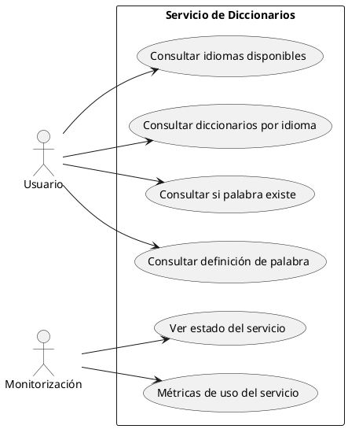
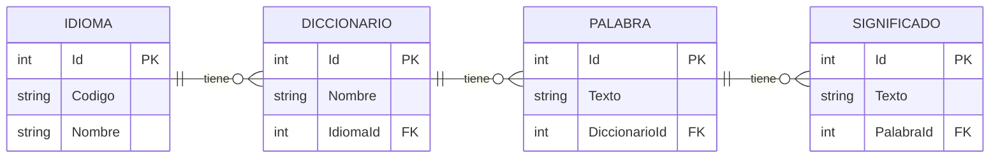
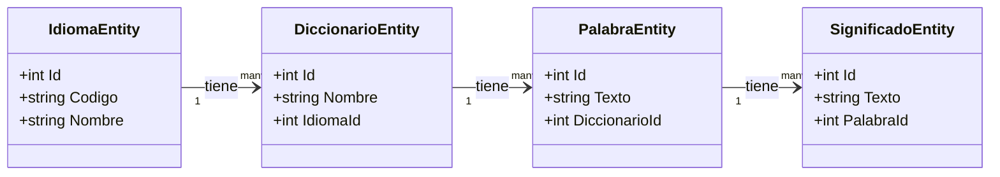
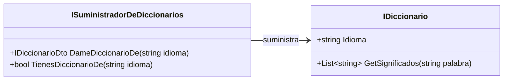
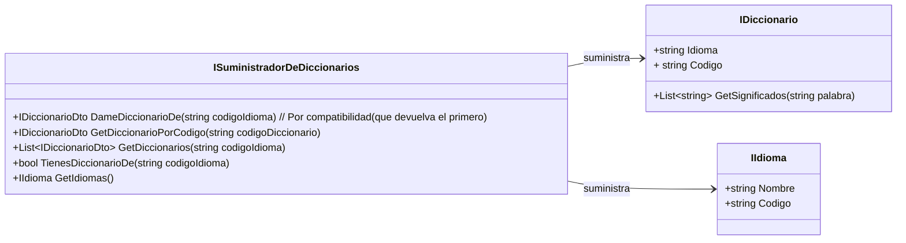

# Servicio REST para el acceso a estos diccionarios.

Hoy en día, esos monolitos se dividen en microservicios.

http://miempresa.com/api/v1/diccionarios
http://miempresa.com/api/v1/idiomas

# Protocolo HTTP

Es un protocolo de comunicación sobre TCP/IP para comunicaciones síncronas unidireccionales.
Si necesito otro tipo de comunicaciones (asincronas/bidxireccionales) no me sirve.
En el mundo web, por ejemplo, para comunicaciones bidireccionales asincronas, se usa WebSockets. ws://


    Cliente ---> http request ---> Servidor
            <--- http response --- 

    Servidor --------------------> Cliente
            (push asincrono)
            notificación

Tanto en request como en response, el mensaje tiene 2 partes en http: HEADERS + BODY (opcional)

Dentro de los headers que se mandan desde el cliente hay algunos notables:
- Authorization
- Content-Type
- Verb (Intención)
    GET -> Obtener recurso
    POST -> Crear recurso
    PUT -> Actualizar recurso
    DELETE -> Borrar recurso
    PATCH -> Actualizar parcialmente un recurso
    HEAD -> Obtener solo los headers de un recurso

Y dentro de los headers de vuelta hay uno especial:
- Response Code :
  - 2XX -> OK
  - 3XX -> Redirección
  - 4XX -> Error del cliente
  - 5XX -> Error del servidor

---

# Proyecto servicio web para acceso a todo este tinglao!

1. Casos de uso (Casos de uso y sus actores). Y de hecho en UML tenemos un diagrama de casos de uso.
   Mermaid no lo soporta. Si lo tiene plantUML.

Actor: 
    Usuario: Alguien que quiere consultar diccionarios... palabras...
    Monitorización: Alguien que quiere ver el estado del servicio web
Casos de uso:
    Usuario: 
        - Consultar los idiomas disponibles
        - Consultar los diccionarios disponibles para un idioma
        - Consultar si una palabra existe en un diccionario
        - Consultar la definición de una palabra en un diccionario
    Monitorización:
        - Ver estado del servicio 
        - Métricas de uso del servicio (Cuantas peticiones, tiempos, errores...)

Generamos ese diagrama en VERTICAL



# Diagrama Entidad Relacion BBDD







# Componente DiccionariosAPI



---

# Cómo queremos que se comporte el sistema?

  Poder hacer búsquedas de palabras en un diccionario y en un idioma
    GetSignificados(string codigoIdioma, string palabra) : List<ISignificado> (Que incorpore información del diccionario)
        api/v1/idiomas/ES?palabra=hola
    GetSignificados(string codigoDiccionario, string palabra) : List<string>
        api/v1/diccionarios/ES_LAROUSE?palabra=hola

Esto implica que hemos de modificar el DiccionariosAPI:


Realmente, todo lo anterior son interfaces, no clases.
---

Al hacer este cambio, el paquete/proyecto DiccionarioFicheros no debe dejar de compilar.

    DiccionariosFicheros V1.0.0
            v
    DiccionariosAPI V1.0.0
            ^
    AppConsola V1.0.0


Vamos a generar la versión        DiccionariosAPI V1.1.0   <   Implicaría que di suben a este versión TODO SIGUE FUNCIONANDO

```csharp
    class ISuministradorDeDiccionarios {
        IDiccionario? DameDiccionarioDe(string codigoIdioma) // Por compatibilidad (que devuelva el primero)
        IDiccionario? GetDiccionarioPorCodigo(string codigoDiccionario)
        IList<IDiccionario>? GetDiccionarios(string codigoIdioma)
        bool TienesDiccionarioDe(string codigoIdioma)
        IIdioma GetIdiomas()
    }

    class IDiccionario {
        string Idioma
        string Codigo {
            get => "DIC_" + Idioma; // Este valor por defecto, nos permite que aquello siga compilando.
        }
        List<string>? GetSignificados(string palabra)
    }
```

Necesitamos dar una implementación por defecto que asegure que DiccionariosFicheros y DiccionariosBBDD sigan compilando.


Los métodos default en interfaces no están para meter código COMUN a varias implementaciones, sino para asegurar compatibilidad hacia atrás... que compile el código antiguo.

Si hay código que comparten varias implementaciones, ese código ha de ir en una clase base abstracta.... como hemos hecho de toda la vida en POO.


---

Modificar el componente de BBDD para que implemente estas nuevas funciones.

    Controlador HTTP
        Expone funciones

    Servicio (Lógica de Negocio)
        Defino las funciones (ALTO NIVEL)
        GetSignificadosDeUnaPalabra
            -----> Libreria BBDD GetSignificadosDeUnaPalabra
            -----> ServicioDeMonitoreo.RegistrarConsulta

---

Por ahora, nos olvidaremos de lo que es la monitorización. Solo meteremos en las funciones del servicio las llamadas a la librería de Diccionarios.
Las funciones que vamos a implementar en el servicio son:
- GetIdiomas                                                List<IIdioma>
- GetDiccionarios(idioma)                                   List<IDiccionario>         
- GetDiccionario(codigoDiccionario)
- GetSignificadosEnDiccionario(codigoDiccionario, palabra)
- GetSignificadosEnIdioma(codigoIdioma, palabra)
- ExistePalabraEnDiccionario(codigoDiccionario, palabra)
- ExistePalabraEnIdioma(codigoIdioma, palabra)