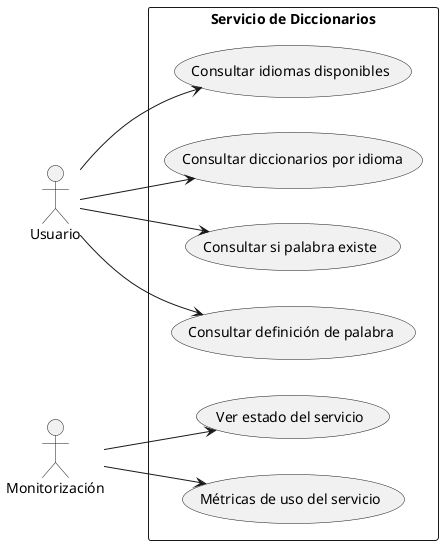
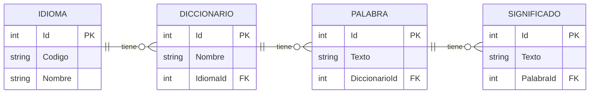
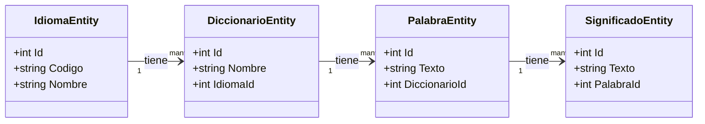
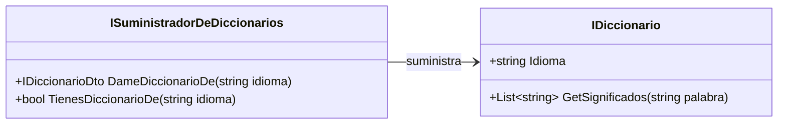
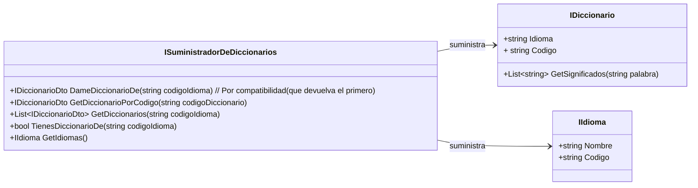

# Servicio REST para el acceso a estos diccionarios.

Hoy en día, esos monolitos se dividen en microservicios.

http://miempresa.com/api/v1/diccionarios
http://miempresa.com/api/v1/idiomas

# Protocolo HTTP

Es un protocolo de comunicación sobre TCP/IP para comunicaciones síncronas unidireccionales.
Si necesito otro tipo de comunicaciones (asincronas/bidxireccionales) no me sirve.
En el mundo web, por ejemplo, para comunicaciones bidireccionales asincronas, se usa WebSockets. ws://


    Cliente ---> http request ---> Servidor
            <--- http response --- 

    Servidor --------------------> Cliente
            (push asincrono)
            notificación

Tanto en request como en response, el mensaje tiene 2 partes en http: HEADERS + BODY (opcional)

Dentro de los headers que se mandan desde el cliente hay algunos notables:
- Authorization
- Content-Type
- Verb (Intención)
    GET -> Obtener recurso
    POST -> Crear recurso
    PUT -> Actualizar recurso
    DELETE -> Borrar recurso
    PATCH -> Actualizar parcialmente un recurso
    HEAD -> Obtener solo los headers de un recurso

Y dentro de los headers de vuelta hay uno especial:
- Response Code :
  - 2XX -> OK
  - 3XX -> Redirección
  - 4XX -> Error del cliente
  - 5XX -> Error del servidor

---

# Proyecto servicio web para acceso a todo este tinglao!

1. Casos de uso (Casos de uso y sus actores). Y de hecho en UML tenemos un diagrama de casos de uso.
   Mermaid no lo soporta. Si lo tiene plantUML.

Actor: 
    Usuario: Alguien que quiere consultar diccionarios... palabras...
    Monitorización: Alguien que quiere ver el estado del servicio web
Casos de uso:
    Usuario: 
        - Consultar los idiomas disponibles
        - Consultar los diccionarios disponibles para un idioma
        - Consultar si una palabra existe en un diccionario
        - Consultar la definición de una palabra en un diccionario
    Monitorización:
        - Ver estado del servicio 
        - Métricas de uso del servicio (Cuantas peticiones, tiempos, errores...)

Generamos ese diagrama en VERTICAL



# Diagrama Entidad Relacion BBDD







# Componente DiccionariosAPI



---

# Cómo queremos que se comporte el sistema?

  Poder hacer búsquedas de palabras en un diccionario y en un idioma
    GetSignificados(string codigoIdioma, string palabra) : List<ISignificado> (Que incorpore información del diccionario)
        api/v1/idiomas/ES?palabra=hola
    GetSignificados(string codigoDiccionario, string palabra) : List<string>
        api/v1/diccionarios/ES_LAROUSE?palabra=hola

Esto implica que hemos de modificar el DiccionariosAPI:


Realmente, todo lo anterior son interfaces, no clases.
---

Al hacer este cambio, el paquete/proyecto DiccionarioFicheros no debe dejar de compilar.

    DiccionariosFicheros V1.0.0
            v
    DiccionariosAPI V1.0.0
            ^
    AppConsola V1.0.0


Vamos a generar la versión        DiccionariosAPI V1.1.0   <   Implicaría que di suben a este versión TODO SIGUE FUNCIONANDO

```csharp
    class ISuministradorDeDiccionarios {
        IDiccionario? DameDiccionarioDe(string codigoIdioma) // Por compatibilidad (que devuelva el primero)
        IDiccionario? GetDiccionarioPorCodigo(string codigoDiccionario)
        IList<IDiccionario>? GetDiccionarios(string codigoIdioma)
        bool TienesDiccionarioDe(string codigoIdioma)
        IIdioma GetIdiomas()
    }

    class IDiccionario {
        string Idioma
        string Codigo {
            get => "DIC_" + Idioma; // Este valor por defecto, nos permite que aquello siga compilando.
        }
        List<string>? GetSignificados(string palabra)
    }
```

Necesitamos dar una implementación por defecto que asegure que DiccionariosFicheros y DiccionariosBBDD sigan compilando.


Los métodos default en interfaces no están para meter código COMUN a varias implementaciones, sino para asegurar compatibilidad hacia atrás... que compile el código antiguo.

Si hay código que comparten varias implementaciones, ese código ha de ir en una clase base abstracta.... como hemos hecho de toda la vida en POO.


---

Modificar el componente de BBDD para que implemente estas nuevas funciones.

    Controlador HTTP
        Expone funciones

    Servicio (Lógica de Negocio)
        Defino las funciones (ALTO NIVEL)
        GetSignificadosDeUnaPalabra
            -----> Libreria BBDD GetSignificadosDeUnaPalabra
            -----> ServicioDeMonitoreo.RegistrarConsulta

---

Por ahora, nos olvidaremos de lo que es la monitorización. Solo meteremos en las funciones del servicio las llamadas a la librería de Diccionarios.
Las funciones que vamos a implementar en el servicio son:
- GetIdiomas                                                List<IdiomaDTO>
- GetDiccionarios(idioma)                                   List<DiccionarioDTO>?         
- GetDiccionario(codigoDiccionario)                         DiccionarioDTO?
- GetSignificadosEnDiccionario(codigoDiccionario, palabra)  List<SignificadoDTO>?
- GetSignificadosEnIdioma(codigoIdioma, palabra)            List<SignificadoDTO>?
- ExistePalabraEnDiccionario(codigoDiccionario, palabra)    bool
- ExistePalabraEnIdioma(codigoIdioma, palabra)              bool


Lo que hacemos al generar esa nueva interfaz IdiomaDTO, muy similar a IIdioma es:
- Cumplir con el principio de segregación de interfaces (ISP): Mejor tener muchas interfaces específicas que pocas y genéricas.
- Aislarnos de cambios en la el el API de diccioanrios (y poe ende de cambios en la BBDD) . Si el día de mañana ese modulo cambia (como ha cambiado hoy v1.0.0->v1.1.0) no afectará a los consumidores del servicio.

Para pasar de objetos de tipo IdiomaEntity a IdiomaDTO, creamos un mapeador con una libreria llamada AutoMapper.

POR AHORA SOLO MONTAMOS LA CAPA DE SERVICIO, NO LA DE CONTROLADOR... es decir, no estamos montando un servicio REST, estamos montando un servicio C#. En ese servicio, como decía, las funciones deben llamar a las de DiccionariosAPI.. pero además, deberian registrar informacion en un servicio de monitorizacion. Servicio que a dia de hoy no tenemos, y lo unico que vamos a hacer es añadir comentarios en el código indicando donde irian esas llamadas.

Por supuesto, este servicio, tendra su API y su implementación, en proyectos C# independientes dentro de la solución.


---


# Capa de controlador REST (ASP.NET Core Web API) que exponga esas funciones a través de HTTP.

Este va a ser un proyecto nuevo, con ASP .NET Core Web API.

En estos proyectos, vamos a usar ese concepto de la Inversion De Control y la inyección de dependencias que ya hemos visto en otras capas/proyectos de nuestra solución (DiccionariosAppHost). Pero en otros proyecto lo hemos hecho a través de un host genérico (Clase que nos da C#.

En estos proyectos, eso también ocurre... pero queda enmascarado por el framework ASP.NET Core, que nos da un objeto WebApplicationBuilder en el que podemos registrar servicios y luego construir un WebApplication que es el que atiende las peticiones HTTP.

```csharp
var builder = WebApplication.CreateBuilder(args);
builder.Services.AddSingleton<ISuministradorDeDiccionarios, SuministradorDeDiccionariosDesdeBBDD>();
builder.Services.AddSingleton<IServicioDiccionarios, ServicioDiccionariosImpl>();

var app = builder.Build(); // Por debajo esto usa el patrón Host que ya conocemos
// Pero ya no tenemos ni que crearlo.

// CREAMOS UN CONTROLADOR COMPLETO

// Esto se llama Atributos en C#.
// En concreto ASP.NET Core usa estos atributos para definir rutas y comportamientos de los controladores REST
[ApiController]
[Route("api/v1/[controller]")]
public class DiccionariosController : ControllerBase
{
    private readonly IServicioDiccionarios _servicioDiccionarios;

    public DiccionariosController(IServicioDiccionarios servicioDiccionarios)
    {
        _servicioDiccionarios = servicioDiccionarios;
    }

    [HttpGet()]
    public ActionResult<IList<IdiomaDTO>> GetIdiomas()
    {
        var idiomas = _servicioDiccionarios.GetIdiomas();
        return Ok(idiomas); // Aqui necesitaremos un nuevo mapeador de IdiomaDTO a IdiomaRestV1DTO
    }

    // Más acciones para los otros casos de uso...
}

// Controlando las posibles excepciones y devolviendo códigos HTTP adecuados.
```


- GetIdiomas                                                List<IdiomaDTO>
        vvvvv
    /api/v1/idiomas                                         List<IdiomaRestV1DTO>
- GetDiccionarios(idioma)                                   List<DiccionarioDTO>?         
        vvvvv
    /api/v1/idiomas/{codigoIdioma}/diccionarios             List<DiccionarioRestV1DTO>
    Si el idioma no existe, devolvemos 404 Not Found
- GetDiccionario(codigoDiccionario)                         DiccionarioDTO?
        vvvvv
    /api/v1/diccionarios/{codigoDiccionario}                DiccionarioRestV1DTO
    Si el diccionario no existe, devolvemos 404 Not Found 
- GetSignificadosEnDiccionario(codigoDiccionario, palabra)  List<SignificadoDTO>?
        vvvvv
    /api/v1/diccionarios/{codigoDiccionario}/significados?palabra={palabra}   List<SignificadoRestV1DTO>
    Si el diccionario no existe, devolvemos 404 Not Found 
    Si la palabra no existe, devolvemos 404 Not Found 
- GetSignificadosEnIdioma(codigoIdioma, palabra)            List<SignificadoDTO>?
        vvvvv
    /api/v1/idiomas/{codigoIdioma}/significados?palabra={palabra}   List<SignificadoRestV1DTO>
    Si el idioma no existe, devolvemos 404 Not Found 
    Si la palabra no existe, devolvemos 404 Not Found
- ExistePalabraEnDiccionario(codigoDiccionario, palabra)    bool
        vvvvv
    /api/v1/diccionarios/{codigoDiccionario}/existe?palabra={palabra}   NADA
    Código HTTP 200 si existe, 404 si no existe
- ExistePalabraEnIdioma(codigoIdioma, palabra)              bool
        vvvvv
    /api/v1/idiomas/{codigoIdioma}/existe?palabra={palabra}   NADA . 
    Código HTTP 200 si existe, 404 si no existe
    
    